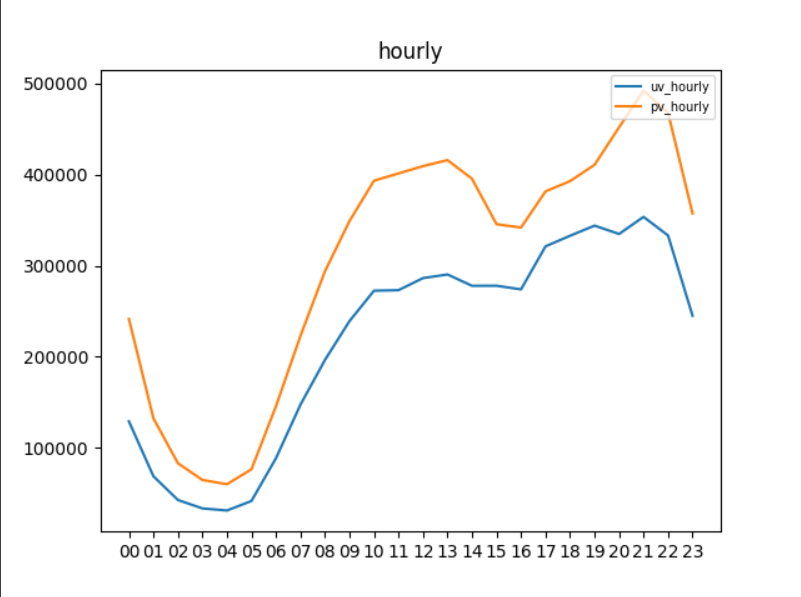
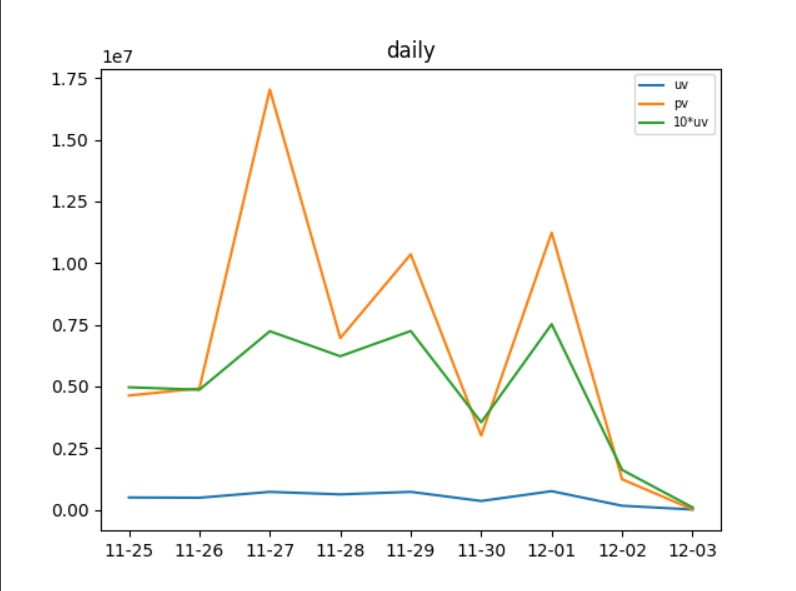
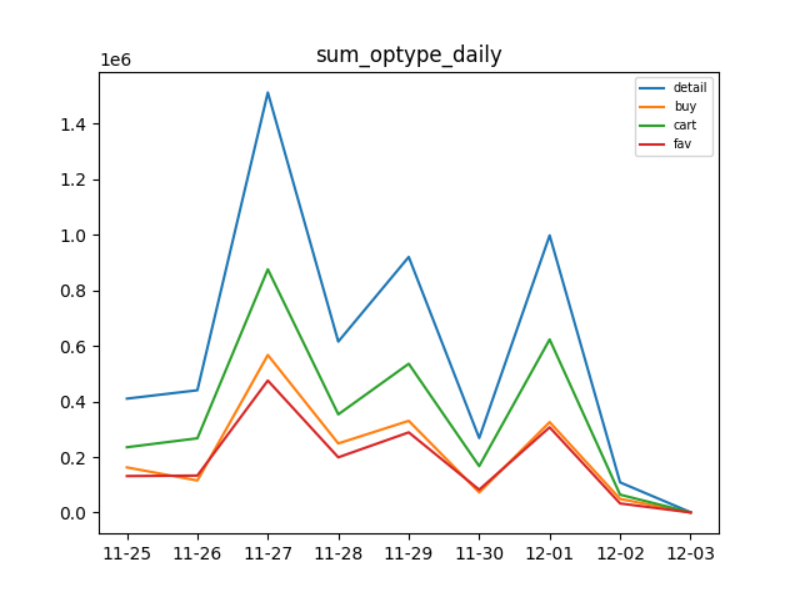
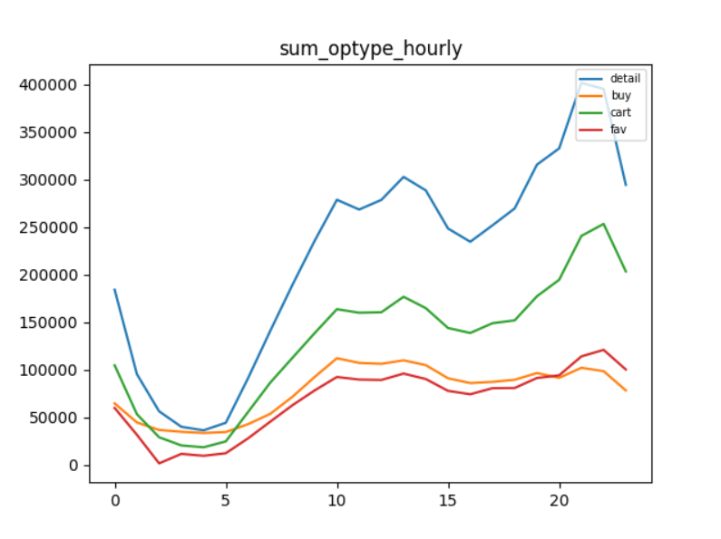
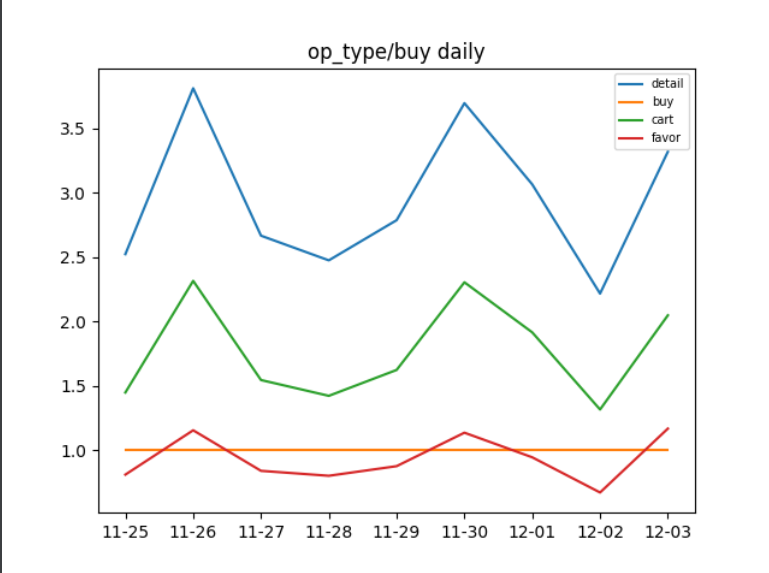
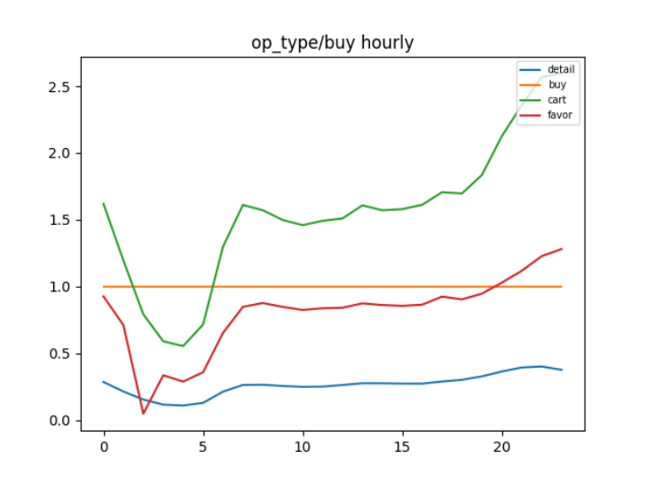

# 数据集成作业二路线二说明

## 1. 小组情况

组号：16

|  姓名  |   学号    |
| :----: | :-------: |
| 杨云波 | 181250176 |
| 胡海川 | 181250046 |
|  郑涛  | 181250200 |
| 潘易辰 | 181250110 |
| 孙博然 | 181250128 |

## 2. 前期准备

本次作业采用了如下的实验环境：

- jdk 8
- MySQL 8.0.23
- Hadoop 3.1.4
- Hive 3.1.2
- sqoop 1.4.7

## 3. 代码结构
+ robotsDataProcess 数据预处理及存储
  - dbhelper.py 数据库工具类
  - init.sql 数据库表初始化脚本
  - LineParser.py 原始数据解析为数据库记录
  - main.py 程序入口
+ robotsDetecting 检测机器人
  - config 项目配置
  - constants 自定义常量
  - utils 工具类包
  - model 实体类
  - dao mybatis接口
  - strategy 策略类包
  - service 服务层
  - controller 控制器层
  - mappers mybatis实现(xml)
+ front_end 文件夹
  - 存放前端代码及配置
## 4. 项目简介
数据处理部分：
建立两张mysql表，分别用来存储原始数据中用户登录信息和用户行为信息。
logins(sessionid,logintime,ip,userid,passwd,authcode)
actions(sessionid,actiontime,actiontype,userid,itemid,categoryid)

对于原始数据，按行读取后，通过对其中指定字段的数据表示进行正则表达式匹配获取对应的值；从而组成数据库记录进行存储。

图1 执行结果

机器人判定部分：
采用基于规则的判定。
爬虫机器人和撞库机器人根据ip记录进行判定；刷单机器人和秒杀机器人根据userid记录进行判定。

|机器人类型|判定规则|
|--------|--------|
|撞库|登录成功率小于预定值|
|爬虫|浏览时间间隔超过阈值|
|刷单|在一定时间内重复购买达到一定次数|
|秒杀|整点购物占比率|

检测过程：
1. 查询userid/ip相关所有记录
2. 将查询结果应用规则进行判断

## 5. 接口设计
|接口名|接口功能|
|--------|--------|
|public List<String> detectAttackers()|检测所有撞库机器人|
|public List<String> detectSpiders()|检测所有爬虫机器人|
|public List<String> detectClickFarmers()|检测所有刷单机器人|
|public List<String> detectOrderCompetitors()|检测所有秒杀机器人|
|public List<String> distinctUser()|返回所有用户userid|
|public List<String> distinctIp()|返回所有ip|
| public int isRobotByIp(@PathVariable(name = "ip")String ip)|根据ip判断用户是否为机器人(1代表撞库,2代表爬虫,-1代表非机器人)|
|public int isRobotByUserId(@PathVariable(name = "userid")String userid)|根据userid判断用户是否为机器人(3代表刷单,4代表秒杀,-1代表非机器人)|

## 6. 正常数据的分析

### 6.1 实验过程

- 数据提取，将得到的数据库数据（dbdata）和流数据（flowdata）存入数据库

  存入过程：

  - 使用python连接数据库，执行sql存储语句
  - 存储过程中先对数据进行筛选（比如第一部分不需要login的数据，那么就去除）
  - 数据存入成功后给数据库建立索引，以提高查询速度

- 数据分析，利用pymysql从数据库获取数据

- 数据可视化，利用matplotlib将得到的数据可视化

实验代码见 part1 文件夹 中 main.py

### 6.2 实验结论

参数说明：

- UV，用户日登录数（当日重复登录只计算一次）

- PV，用户访问数（总量）

由于 UV 数量大大少于 PV ，因此图中UV数量实际被乘了10

可以看出用户一般都是在中午浏览和登录，同时晚上21点达到高峰，深夜最低。比较符合生活常识，中午午休，抽空浏览商城，同时晚上下班后睡前可能比较无聊，因此浏览和登录频数激增，深夜都睡觉了，访问量当然低。

可以看到在26号时，访问量激增，在11.30后达到低谷，推测月底商家冲业绩做了活动，因此访问量增加。

此图与上图情况符合，月底时访问量激增

此图与小时uv、pv图与比较吻合，但发现半夜访问量增加的比较多，购买行为却并没有很明显的增加，推测大家更喜欢晚上浏览心怡的商品，但并不急于下单，整个购买行为偏稳定

显然月底购买行为更多

由此图可以推测，在半夜人们更倾向与购买，而不是收藏等（比值小于1），而在晚上访问高峰期，大家更愿意先添加购物车，也比较符合尝试，晚上先添加购物车（比值大于1）而在高峰期过后，购买数量显然增加，因为大家在前半夜已经将喜欢的商品添加进了购物车（收藏），逛也逛够了，于是就下单购买。

